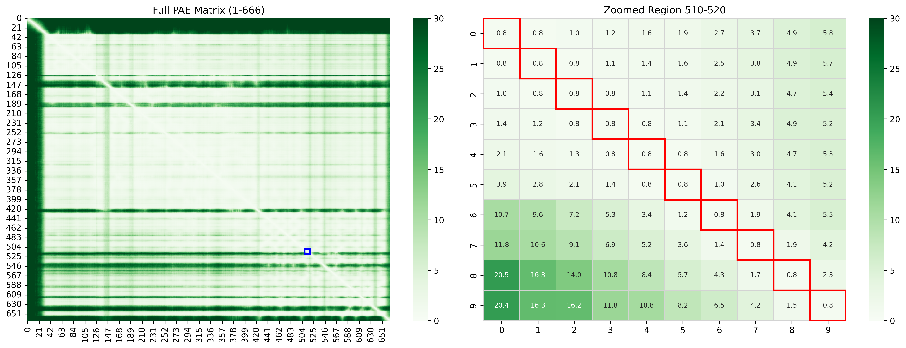

# Tool to visualise specific areas in a PAE plot.
This is a simple tool that allows you to visualise an area in a PAE plot.

## Usage

### Simple python script

Just run the script as a normal python script

`python PAE_asymmetry.py`

and follow the prompts

Expected results

```bash
Path to ColabFold JSON file: json_test.json
Loaded 666 residue matrix

Available residues: 1-666
Analyze region (start-end) e.g. 20-30 or 'q' to quit: 510-520

Available residues: 1-666
Analyze region (start-end) e.g. 20-30 or 'q' to quit: q
```
The produced plot is saved as `pae_visualization.png`
and presented in a separate window upon successful run.



### Jupyter notebook

Just load the jupyter notebook `PAE_asymmetry.ipynb` and run the cells.

### As presented in the articles below
1. [Playing with a Nobel prize winner tool: Exploring AlphaFold with ColabFold](https://www.linkedin.com/pulse/playing-nobel-prize-winner-tool-exploring-alphafold-delitheos-cn6fc/?trackingId=BFnZwRJXQny9kcgWgaSVwQ%3D%3D)
2. [Playing with a Nobel prize winner tool (part 2): Interpreting the results of ColabFold-AF2](https://www.linkedin.com/pulse/playing-nobel-prize-winner-tool-part-2-interpreting-results-delitheos-cn6fc/?trackingId=BFnZwRJXQny9kcgWgaSVwQ%3D%3D)
3. [Playing with a Nobel prize winner tool (part 3): Further analysis of the results of ColabFold-AF2](https://www.linkedin.com/pulse/playing-nobel-prize-winner-tool-part-3-further-analysis-delitheos-cn6fc/?trackingId=BFnZwRJXQny9kcgWgaSVwQ%3D)
