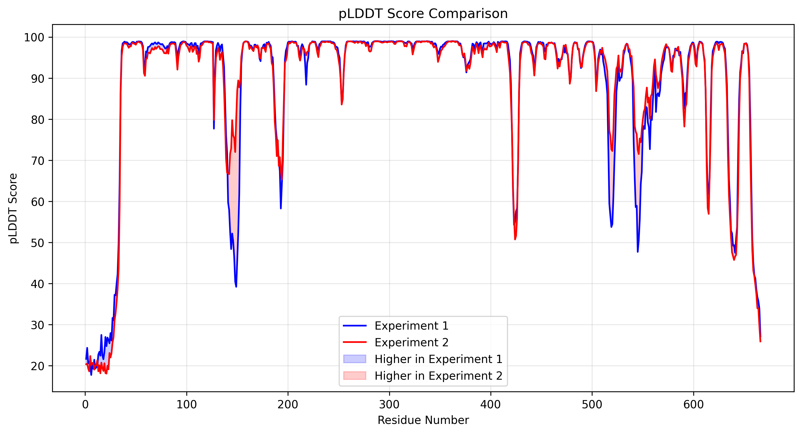

# pLDDT comparison tool
This is a simple tool that allows you to compare the pLDDT scores between two experiments on folding a protein structure as predicted by ColabFold.

### Usage

To use this script, you will need a the two `.json` files from the two experiments from ColabFold.

```bash
python pLDDT_comparison.py <path_to_json_from_experiment_1> <path_to_json_from_experiment_2>  --label1 "Experiment 1" --label2 "Experiment 2"  --output "Comparison_Results"
```

Replace `<path_to_json_from_experiment_1>` and `<path_to_json_from_experiment_2>` with the actual paths to your JSON files. The two labels are the labels that will be used in the legend of the plot.

The script will generate a combined pLDDT plot of the two experiments and highlight the areas that are different between them.



### As presented in the articles below
1. [Playing with a Nobel prize winner tool: Exploring AlphaFold with ColabFold](https://www.linkedin.com/pulse/playing-nobel-prize-winner-tool-exploring-alphafold-delitheos-cn6fc/?trackingId=BFnZwRJXQny9kcgWgaSVwQ%3D%3D)
2. [Playing with a Nobel prize winner tool (part 2): Interpreting the results of ColabFold-AF2](https://www.linkedin.com/pulse/playing-nobel-prize-winner-tool-part-2-interpreting-results-delitheos-cn6fc/?trackingId=BFnZwRJXQny9kcgWgaSVwQ%3D%3D)
3. [Playing with a Nobel prize winner tool (part 3): Further analysis of the results of ColabFold-AF2](https://www.linkedin.com/pulse/playing-nobel-prize-winner-tool-part-3-further-analysis-delitheos-cn6fc/?trackingId=BFnZwRJXQny9kcgWgaSVwQ%3D)
