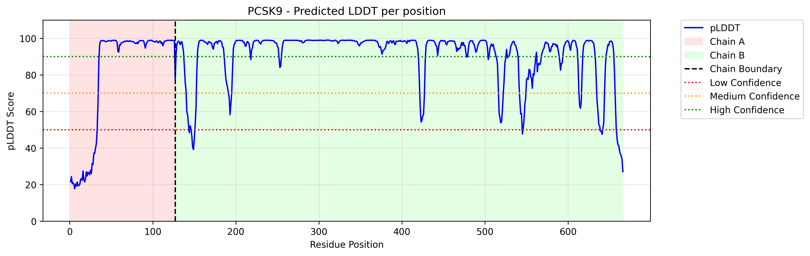

# Single pLDDT plotting tool
This is a simple tool that allows you to visualize the pLDDT scores for a single protein structure predicted by ColabFold.

### Usage

To use this script, you will need a the `.pdb` and `.json` files of a protein structure model predicted by ColabFold.

```bash
python pLDDT_single_example.py <path_to_your_model_pdb_file> <path_to_your_model_json_file>  --model_name "Protein X" --output "Protein_X"
```

Replace `<path_to_your_model_pdb_file>` and `<path_to_your_plddt_json_file>` with the actual paths to your PDB and JSON files.

The script will generate a pLDDT plot with chain shading and pLDDT thresholds.



### As presented in the articles below
1. [Playing with a Nobel prize winner tool: Exploring AlphaFold with ColabFold](https://www.linkedin.com/pulse/playing-nobel-prize-winner-tool-exploring-alphafold-delitheos-cn6fc/?trackingId=BFnZwRJXQny9kcgWgaSVwQ%3D%3D)
2. [Playing with a Nobel prize winner tool (part 2): Interpreting the results of ColabFold-AF2](https://www.linkedin.com/pulse/playing-nobel-prize-winner-tool-part-2-interpreting-results-delitheos-cn6fc/?trackingId=BFnZwRJXQny9kcgWgaSVwQ%3D%3D)
3. [Playing with a Nobel prize winner tool (part 3): Further analysis of the results of ColabFold-AF2](https://www.linkedin.com/pulse/playing-nobel-prize-winner-tool-part-3-further-analysis-delitheos-cn6fc/?trackingId=BFnZwRJXQny9kcgWgaSVwQ%3D)
